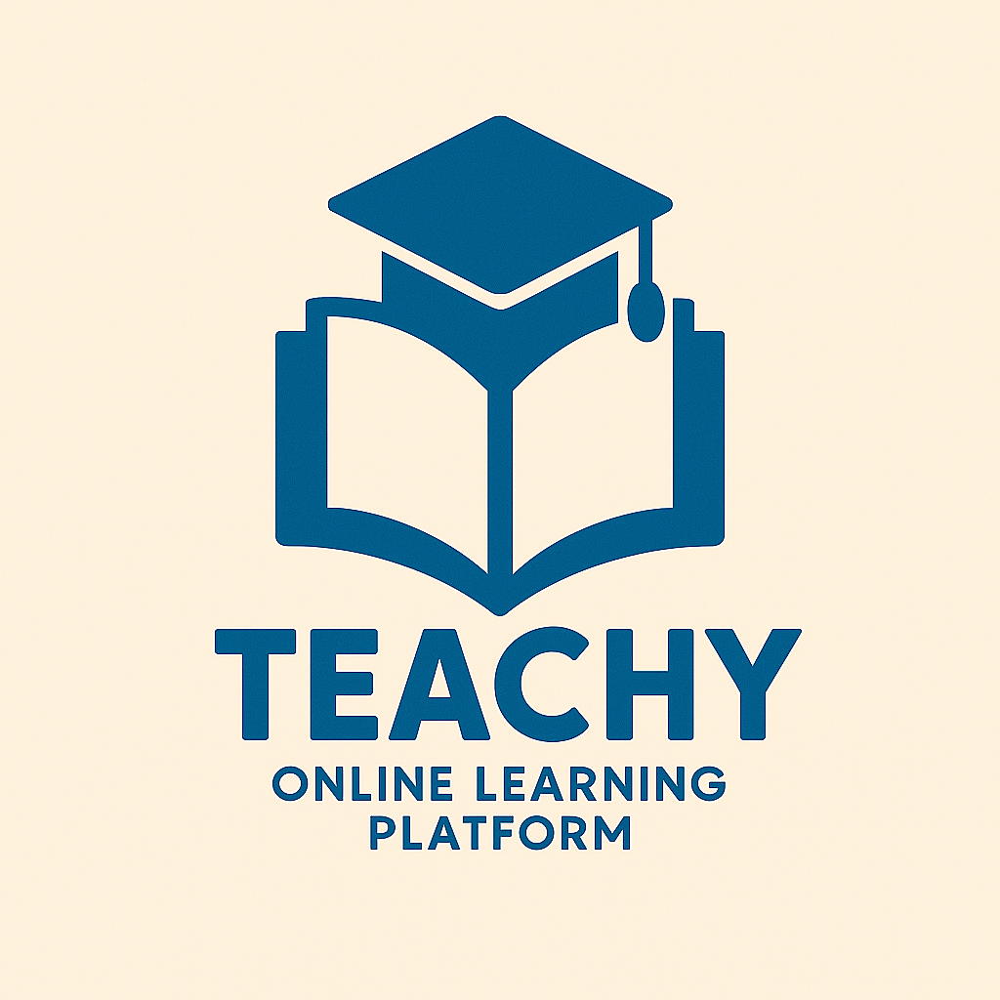
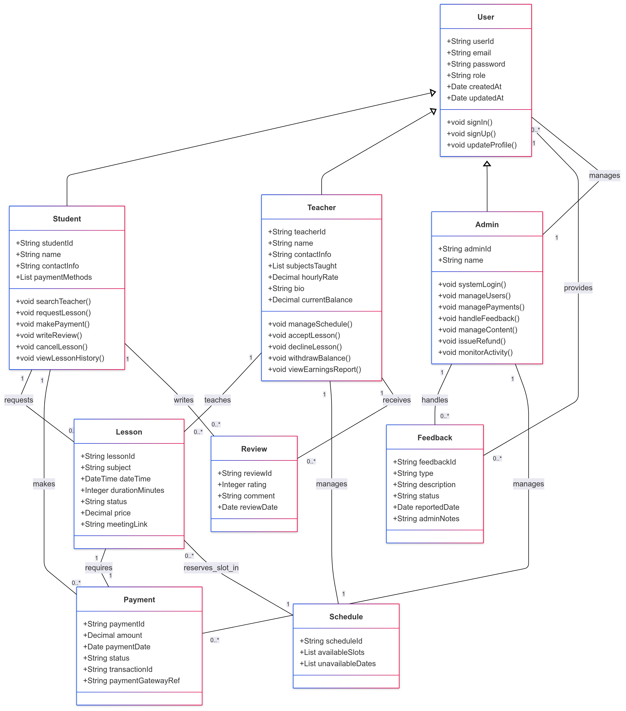
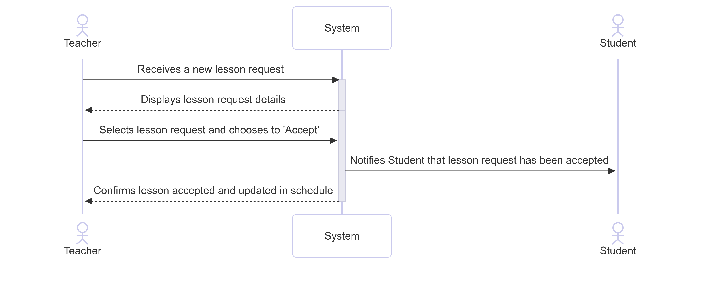
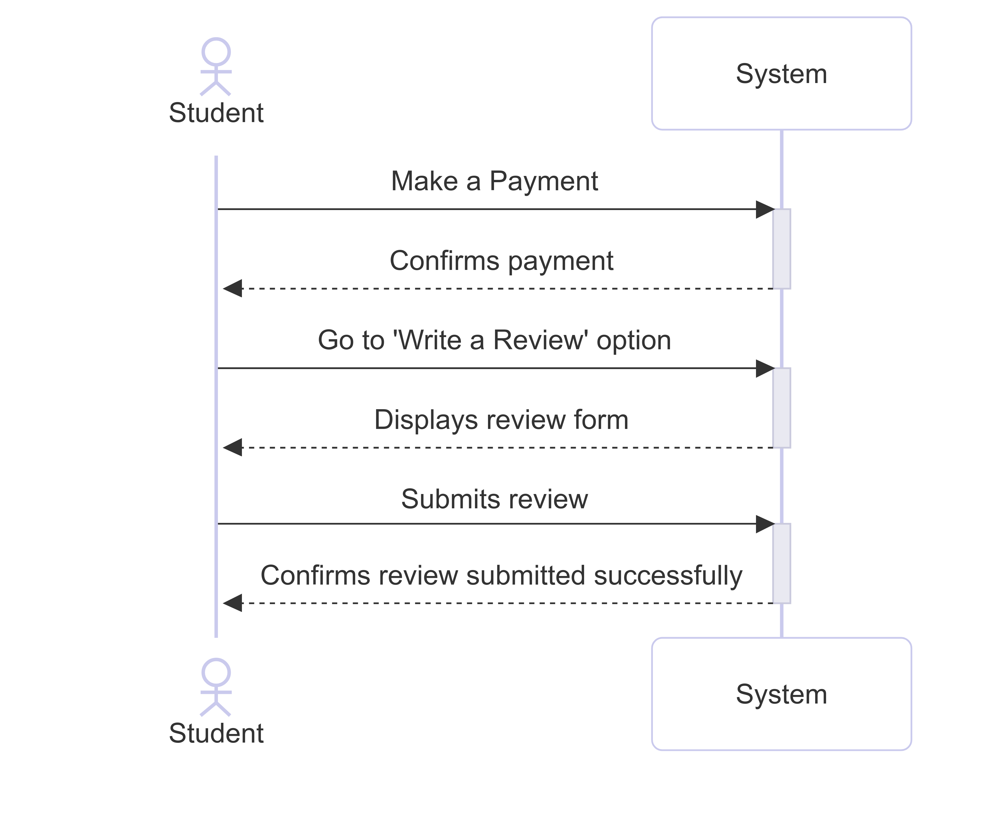
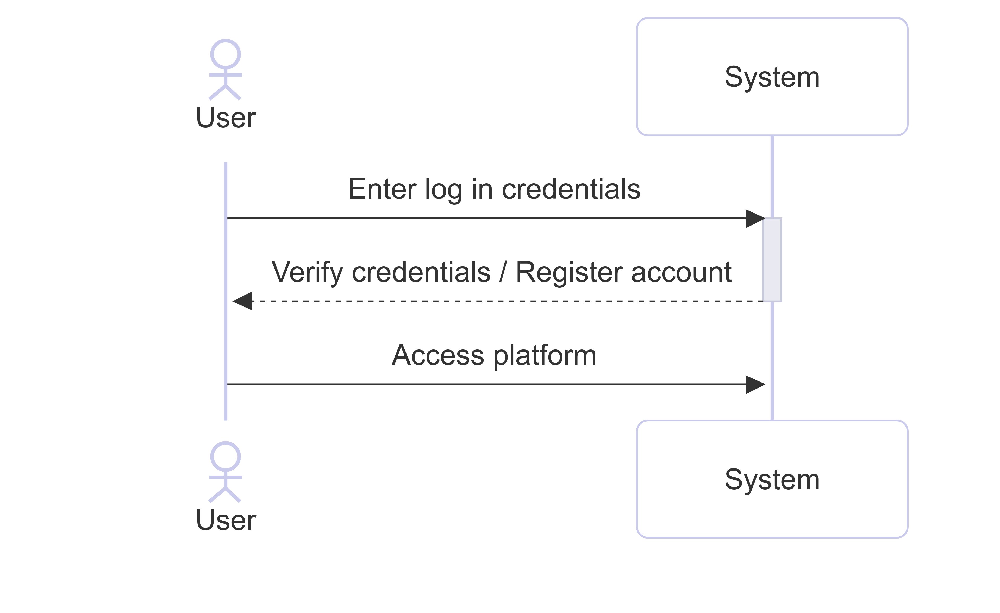

# 🎓 Teachy – Online Learning Platform



---

## 📖 Project Overview
Teachy is an **online learning platform** developed as part of an academic project.  
It is built with **Spring Boot, PostgreSQL, Docker, and CI/CD pipelines**.  
The platform allows **students and teachers** to interact, schedule lessons, and manage educational content in a secure and scalable way.

---

## 🏗️ Architecture
The project follows the **MVC (Model–View–Controller)** architectural pattern:

- **Model** → JPA Entities (Student, Teacher, Course, Lesson, Message, etc.)
- **View** → Initially Thymeleaf, later migrating toward a modern front-end stack
- **Controller** → REST APIs and web controllers, handling user requests

### UML Diagrams

#### Class Diagram


#### Sequence Diagrams




#### Use Case Model


---

## 🎨 Design Patterns

We applied several **Design Patterns** to improve maintainability and scalability:

- **Factory Pattern**  
  Used in user registration to create `Student` or `Teacher` objects dynamically depending on the role.  
  This keeps the creation logic centralized and easier to extend.

- **Facade Pattern**  
  Provides a unified interface (`UserFacade`) to multiple subsystems (authentication, profile, lessons).  
  It hides complexity and simplifies interactions for higher-level modules.

- **Cache Pattern (LRU)**  
  Implemented an **LRU Cache** to optimize repeated queries (e.g., lessons or teacher info).  
  This reduces DB load and improves performance.

```java
public class LRUCacheAlgo<K,V> implements CacheAlgo<K,V> {
    private final Map<K,V> cache;
    // LinkedHashMap with removeEldestEntry for LRU eviction
}